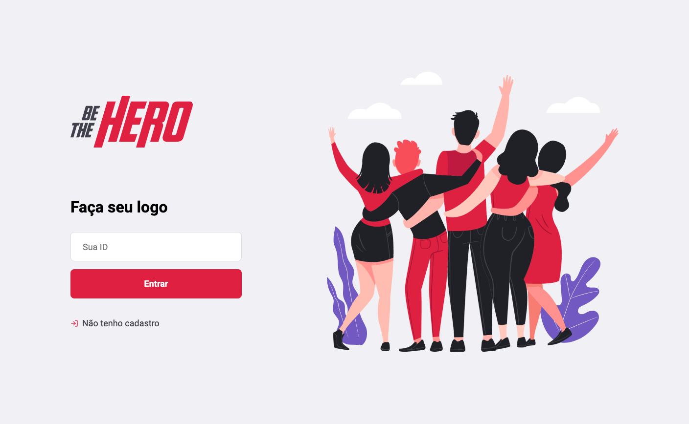
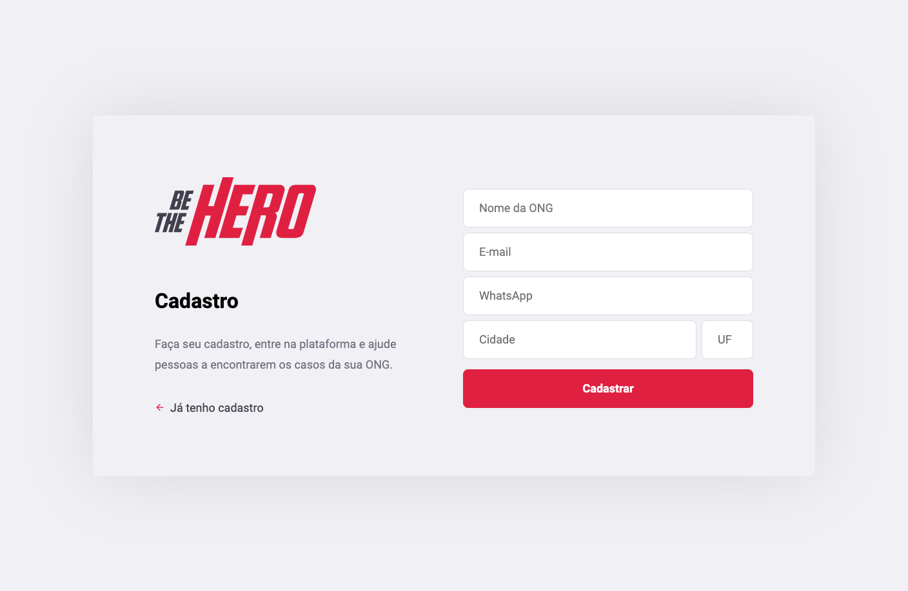
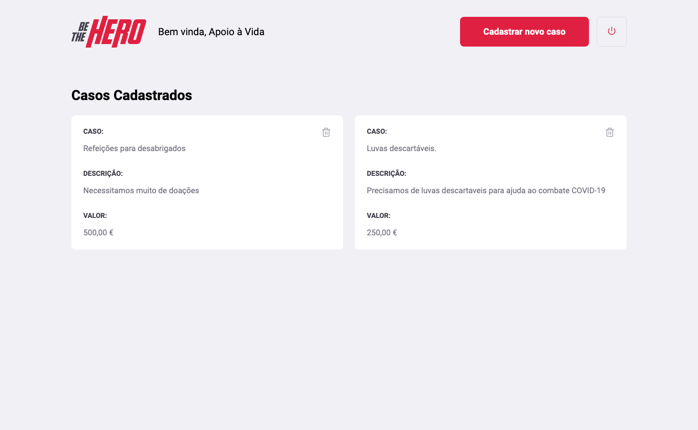
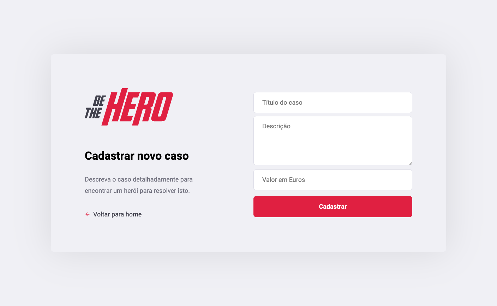
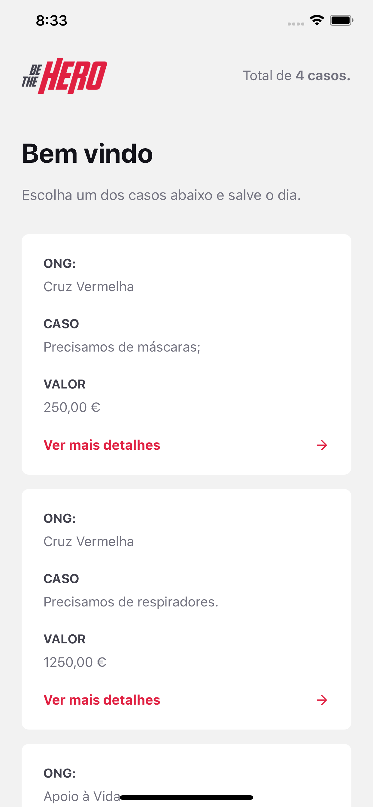
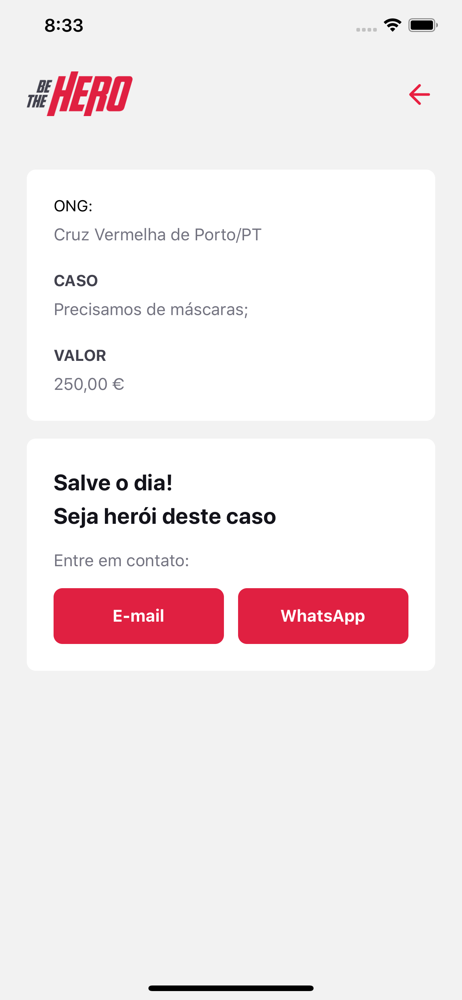

# Be the Hero

Developed during coronavirus lockdown to still coding and having fun.

The world is on lockdown for the global good, what do you do in your lockdown? It is time to take advantage of the time that is at home to enjoy the family, and studies. Did anyone mention studies? Come on.
App developed during rocketseat's omnistack week.

App for registering help requests to fight the cororna virus.

Technologies:

- Node.js
- React.js
- React Native

